# Admin Portal — Customers Module Use Case Diagram

**Sources:** ADMIN-BRD-Customers.md · ADMIN-FS-Customers.md · ADMIN-FS-Customers-Milestones.md · ADMIN-FS-Customers-UnitSwap.md · ADMIN-FS-Customers-Parking.md
**Last Updated:** 2026-05-21

---

## Actors

- **Admin** — primary actor. Sales Manager Admin has identical permissions.
- **Buyer** — secondary actor. Receives notifications for some flows (Cancel Registration, Home Loan Approval, Assign Unit). Receives **nothing** for the three new features (View Milestones, Unit Swap, Update Parking).
- **System** — automated actor (KPI refresh, audit log, Mavis sync, LSQ sync, WebSocket cache invalidation).

---

## Use Case Diagram (Mermaid)

```mermaid
flowchart LR
    %% Actors
    Admin(["fa:fa-user Admin /<br/>Sales Manager Admin"])
    Buyer(["fa:fa-user Buyer<br/>(secondary)"])
    System(["fa:fa-cog System"])

    %% READ OPERATIONS group
    subgraph READ ["Read Operations"]
        UC1[/"View Registration Dashboard<br/>(KPI cards + table)"/]
        UC2[/"Search by Phone"/]
        UC3[/"Filter Registrations"/]
        UC4[/"Paginate Table"/]
        UC5[/"Refresh Table"/]
        UC9a[/"View Milestone Schedule<br/>(read-only navigation)"/]
        UC9b[/"View Transaction Details<br/>(drawer)"/]
        UC12[/"Download Export<br/>(RegistrationData.xlsx, all records)"/]
    end

    %% REVERSIBLE WRITE OPERATIONS group
    subgraph WRITE_REV ["Write Operations - Reversible / Re-runnable"]
        UC8[/"Approve Home Loan<br/>(toggle on row)"/]
        UC11[/"Update Parking Details<br/>(toggle / count / amount)"/]
        UC9c[/"Record Offline Milestone Payment<br/>(11-field multipart)"/]
    end

    %% IRREVERSIBLE WRITE OPERATIONS group
    subgraph WRITE_IRREV ["Write Operations - Irreversible"]
        UC6[/"Cancel Unit<br/>(Booked rows)"/]
        UC7[/"Cancel Registration<br/>(Registered/Waitlisted, refunds 999)"/]
        UC10[/"Unit Swap<br/>(Booked rows)"/]
        UC13[/"Assign Unit / Offline Booking<br/>(Registered rows)"/]
        UC14[/"Bulk Cancel Units"/]
    end

    %% Mandatory sub-steps (<<include>>)
    UC6_inc1[/"Attest Activity cleanup<br/>(Token, Form, Booking deleted)"/]
    UC6_inc2[/"Attest Mavis cleanup<br/>(Booking entry deleted)"/]
    UC10_inc1[/"Pick Tower"/]
    UC10_inc2[/"Pick Target Unit<br/>(AVAILABLE or RESERVED, any typology)"/]
    UC10_inc3[/"Attest Activity cleanup"/]
    UC10_inc4[/"Attest Mavis cleanup"/]
    UC11_inc1[/"Toggle Parking Enabled"/]
    UC11_inc2[/"Enter Count (1-500) + Amount<br/>(only when toggle ON)"/]
    UC13_inc1[/"Pick Tower + Unit"/]
    UC13_inc2[/"Enter Transaction details<br/>(ID, Mode, Amount, Date)"/]

    %% Optional sub-steps (<<extend>>)
    UC9d[/"Navigate Back to Customer Listing"/]
    UC3_ext[/"Reset Filters"/]
    UC13_ext[/"Upload Payment Proof (optional)"/]
    UC9c_ext[/"Select Payment For: Principal or GST<br/>(only when non-HCF AND both outstanding > 0)"/]

    %% System-side automation
    UC_SYS_KPI[/"Refresh KPI counts (live)"/]
    UC_SYS_AUDIT[/"Write audit log entry"/]
    UC_SYS_MAVIS[/"Sync Mavis (ERP)"/]
    UC_SYS_LSQ[/"Sync LeadSquared (CRM)"/]
    UC_SYS_WS[/"Invalidate WebSocket unit cache"/]
    UC_SYS_NOTIFY[/"Dispatch Kaleyra SMS / WhatsApp / Email"/]

    %% Admin associations - Read
    Admin --- UC1
    Admin --- UC2
    Admin --- UC3
    Admin --- UC4
    Admin --- UC5
    Admin -- "only when row isBooked" --- UC9a
    Admin --- UC9b
    Admin --- UC12

    %% Admin associations - Reversible Write
    Admin -- "any row state" --- UC8
    Admin -- "only when row isBooked" --- UC11
    Admin -- "only on payable milestone row<br/>(past startDate, outstanding > 0)" --- UC9c

    %% Admin associations - Irreversible Write
    Admin -- "only when row is Booked<br/>(status=WINNER + allocationTransactionId)" --- UC6
    Admin -- "only when row is Registered or Waitlisted" --- UC7
    Admin -- "only when row isBooked<br/>AND NO active allocation campaign<br/>AND NO Mavis booking row" --- UC10
    Admin -- "only when row is Registered<br/>AND no unit allotted" --- UC13
    Admin --- UC14

    %% Include relationships - mandatory sub-steps
    UC6 -. "<<include>>" .-> UC6_inc1
    UC6 -. "<<include>>" .-> UC6_inc2
    UC10 -. "<<include>>" .-> UC10_inc1
    UC10 -. "<<include>>" .-> UC10_inc2
    UC10 -. "<<include>>" .-> UC10_inc3
    UC10 -. "<<include>>" .-> UC10_inc4
    UC11 -. "<<include>>" .-> UC11_inc1
    UC11 -. "<<include>>" .-> UC11_inc2
    UC13 -. "<<include>>" .-> UC13_inc1
    UC13 -. "<<include>>" .-> UC13_inc2

    %% Extend relationships - optional sub-steps
    UC3_ext -. "<<extend>>" .-> UC3
    UC9d -. "<<extend>>" .-> UC9a
    UC13_ext -. "<<extend>>" .-> UC13
    UC9c_ext -. "<<extend>>" .-> UC9c

    %% System automation triggers
    UC1 -. triggers .-> UC_SYS_KPI
    UC5 -. triggers .-> UC_SYS_KPI
    UC6 -. triggers .-> UC_SYS_AUDIT
    UC6 -. triggers .-> UC_SYS_WS
    UC7 -. triggers .-> UC_SYS_AUDIT
    UC7 -. triggers .-> UC_SYS_NOTIFY
    UC7 -. triggers .-> UC_SYS_WS
    UC8 -. triggers .-> UC_SYS_AUDIT
    UC8 -. triggers .-> UC_SYS_LSQ
    UC8 -. triggers .-> UC_SYS_NOTIFY
    UC10 -. triggers .-> UC_SYS_AUDIT
    UC10 -. triggers .-> UC_SYS_WS
    UC11 -. triggers .-> UC_SYS_AUDIT
    UC13 -. triggers .-> UC_SYS_AUDIT
    UC13 -. triggers .-> UC_SYS_MAVIS
    UC13 -. triggers .-> UC_SYS_LSQ
    UC13 -. triggers .-> UC_SYS_NOTIFY
    UC13 -. triggers .-> UC_SYS_WS
    UC9c -. triggers .-> UC_SYS_AUDIT

    %% Buyer involvement - only via notifications
    UC_SYS_NOTIFY --- Buyer

    %% System actor connections
    UC_SYS_KPI --- System
    UC_SYS_AUDIT --- System
    UC_SYS_MAVIS --- System
    UC_SYS_LSQ --- System
    UC_SYS_WS --- System
    UC_SYS_NOTIFY --- System

    classDef readOp fill:#e3f2fd,stroke:#1565c0
    classDef writeRev fill:#fff8e1,stroke:#f9a825
    classDef writeIrrev fill:#ffebee,stroke:#c62828
    classDef sysOp fill:#f3e5f5,stroke:#6a1b9a
    class UC1,UC2,UC3,UC4,UC5,UC9a,UC9b,UC12 readOp
    class UC8,UC11,UC9c writeRev
    class UC6,UC7,UC10,UC13,UC14 writeIrrev
    class UC_SYS_KPI,UC_SYS_AUDIT,UC_SYS_MAVIS,UC_SYS_LSQ,UC_SYS_WS,UC_SYS_NOTIFY sysOp
```

---

## Eligibility Gate Summary

| Use case | Front-end gate | Backend gate(s) |
|----------|---------------|-----------------|
| Cancel Unit | Trash icon on Booked row (status=WINNER + allocationTransactionId) | PUT adminCancelAllUnits — no further gate |
| Cancel Registration | Trash icon on Registered / Waitlisted row | PUT refundRegistrationUnit — no further gate |
| View Milestones | Three-dot menu only when isBooked | None (read-only) |
| Record Offline Milestone Payment | Button visible only when milestoneKey !== 'ml-or' OR total !== 0, startDate in past, outstanding > 0 | Amount > 0; GST mode amount == gstOutstanding (±0.01); paymentProof required |
| Unit Swap | Three-dot menu only when isBooked | NO active campaign + NO Mavis row + target ∈ {AVAILABLE, RESERVED} + typology mapped + not already linked elsewhere |
| Update Parking | Three-dot menu only when isBooked | additionalParkingEnabled boolean required; delta ≠ 0; pool ≥ delta |
| Home Loan Approval | Always | loanApprovalStatus pending or null |
| Assign Unit | Three-dot menu only when Registered AND no unit allotted | Unit re-check at submit; single-booking constraint |
| Bulk Cancel Units | Always available | Inherits per-row gates |

---

## Notification Matrix

| Use case | Buyer notification |
|----------|--------------------|
| Cancel Unit | None (Kaleyra not invoked on this branch) |
| Cancel Registration | Kaleyra SMS + WhatsApp |
| Home Loan Approval | Kaleyra SMS + WhatsApp |
| Assign Unit / Offline Booking | Kaleyra Email + WhatsApp |
| View Milestones | None (read-only) |
| Record Offline Milestone Payment | TBC |
| **Unit Swap** | **None** |
| **Update Parking** | **None** |

Buyer is therefore a passive secondary actor only for Cancel Registration, Home Loan Approval, and Assign Unit. For the three new menu actions (View Milestones, Unit Swap, Update Parking), the buyer is not involved in any system-side flow.
